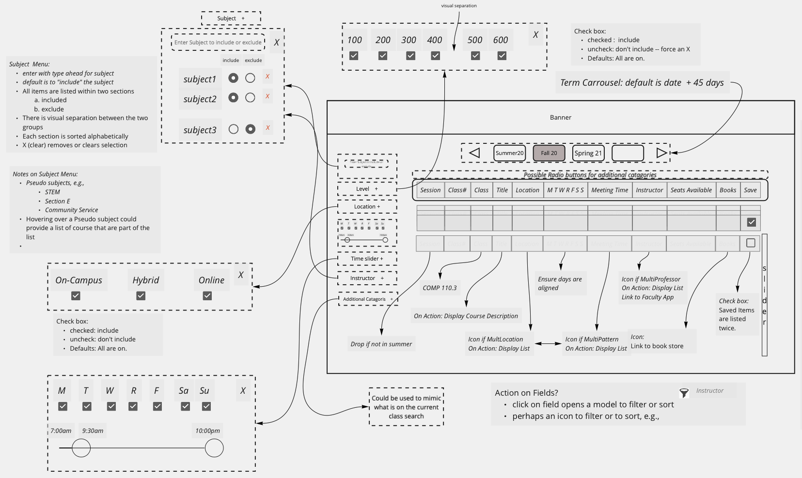

# Class-Search
This is a learning project (Bootstrap and Vue) to recreate a responsive website to search for classes.

As a vehicle to learn BootStrap and Vue, this project seeks to develop a new class-search web application.
This application is being designed as a front-end only tool that consumes data from a JSON-based web service.

The application seeks to improve the UI/UX experience of the class-search application provided at:  https://www.csun.edu/class-search.
The JSON-based web service, known as the Curriculum Web Service, can be found at:  https://api.sandox.csun.edu

# Initial Design
Via the following image, you can see the rough design of the product.

# Deployed Version
As part of the learning process, incremental versions for the application will be develop and tagged.  The most recent version of the application can be viewed at: https://www.sandbox.csun.edu/~steve/class-search

# Versions

Version | Title | Description
------------ | ------------- | -------
v0.1 | Intial Project Setup | Creation of an intial set of files to have both Bootstrap and Vue setup
v0.2 | Grid Layout  | Use Bootstrap containers to create a responsive layout
v0.3 | Expandabe Filter Boxes | Create expandable boxes for each of the filters that can be provided
v0.4 | Curriculum API Consumption | Setup Vue to consume and display initial class data
v0.5 | Checkbox Filters | Added the checkbox, with v-models, for the Location, Days, and Academic Level

# Roadmap

Version | Title |  Description
------- | ------|----
v0.6    |
v0.7    |
v0.8    |
v1.0    | MVP: Minimaul Viable Product
